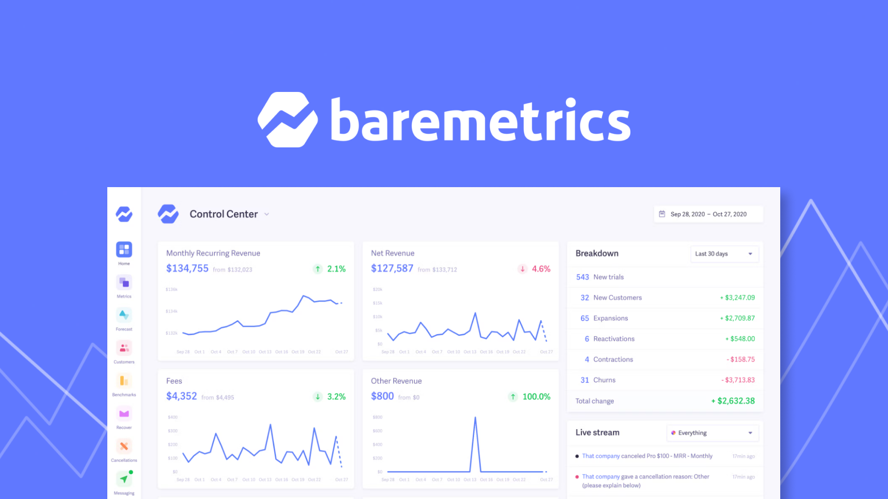

<div align="left">

[](https://baremetrics.com)

# Baremetrics<a id="baremetrics"></a>

Baremetrics provides real-time subscription metrics for teams built with Stripe, Shopify Partners, Braintree, Recurly, Chargebee, Google Play, and App Store Connect. 

In addition to metrics, Baremetrics provides tools that help you reduce churn and grow your business faster: 

Recover: Prevent failed charges and keep your hard-earned revenue with our 100% automated toolkit. 

Cancellation insights: Learn exactly why your customers cancel, calculate lost revenue by cancellation reason, and send automated emails to win customers back.

Flightpath: Plan for the future with flexible financial modeling tools built for growing SaaS companies.


</div>

## Table of Contents<a id="table-of-contents"></a>

<!-- toc -->

- [Requirements](#requirements)
- [Installation](#installation)
- [Getting Started](#getting-started)
- [Async](#async)
- [Raw HTTP Response](#raw-http-response)
- [Reference](#reference)
  * [`baremetrics.account.get_details`](#baremetricsaccountget_details)
  * [`baremetrics.annotation.create_new`](#baremetricsannotationcreate_new)
  * [`baremetrics.annotation.get_details`](#baremetricsannotationget_details)
  * [`baremetrics.annotation.list`](#baremetricsannotationlist)
  * [`baremetrics.annotation.remove_by_id`](#baremetricsannotationremove_by_id)
  * [`baremetrics.attribute.create_field`](#baremetricsattributecreate_field)
  * [`baremetrics.attribute.get_fields`](#baremetricsattributeget_fields)
  * [`baremetrics.attribute.set_properties`](#baremetricsattributeset_properties)
  * [`baremetrics.attribute.update_field`](#baremetricsattributeupdate_field)
  * [`baremetrics.cancellation_insight.create_new_reason`](#baremetricscancellation_insightcreate_new_reason)
  * [`baremetrics.event.create_insight_event`](#baremetricseventcreate_insight_event)
  * [`baremetrics.event.get_event_by_id`](#baremetricseventget_event_by_id)
  * [`baremetrics.event.list_cancellation_insight_events`](#baremetricseventlist_cancellation_insight_events)
  * [`baremetrics.event.update_event_by_id`](#baremetricseventupdate_event_by_id)
  * [`baremetrics.goal.create_new_goal`](#baremetricsgoalcreate_new_goal)
  * [`baremetrics.goal.get_by_id`](#baremetricsgoalget_by_id)
  * [`baremetrics.goal.get_list`](#baremetricsgoalget_list)
  * [`baremetrics.goal.remove`](#baremetricsgoalremove)
  * [`baremetrics.metric.list_customers`](#baremetricsmetriclist_customers)
  * [`baremetrics.metric.show_cohorts`](#baremetricsmetricshow_cohorts)
  * [`baremetrics.metric.show_details`](#baremetricsmetricshow_details)
  * [`baremetrics.metric.show_plan_breakout`](#baremetricsmetricshow_plan_breakout)
  * [`baremetrics.metric.show_summary`](#baremetricsmetricshow_summary)
  * [`baremetrics.reason.delete_by_id`](#baremetricsreasondelete_by_id)
  * [`baremetrics.reason.list_reasons`](#baremetricsreasonlist_reasons)
  * [`baremetrics.reason.show_details`](#baremetricsreasonshow_details)
  * [`baremetrics.reason.update_reason_by_id`](#baremetricsreasonupdate_reason_by_id)
  * [`baremetrics.segment.create_request`](#baremetricssegmentcreate_request)
  * [`baremetrics.segment.find_without_save`](#baremetricssegmentfind_without_save)
  * [`baremetrics.segment.get_fields`](#baremetricssegmentget_fields)
  * [`baremetrics.segment.list_segments`](#baremetricssegmentlist_segments)
  * [`baremetrics.segment.remove_by_id`](#baremetricssegmentremove_by_id)
  * [`baremetrics.segment.show_details`](#baremetricssegmentshow_details)
  * [`baremetrics.segment.update_by_id`](#baremetricssegmentupdate_by_id)
  * [`baremetrics.source.cancel_subscription`](#baremetricssourcecancel_subscription)
  * [`baremetrics.source.create_charge_one_off`](#baremetricssourcecreate_charge_one_off)
  * [`baremetrics.source.create_customer_record`](#baremetricssourcecreate_customer_record)
  * [`baremetrics.source.create_one_off_refund`](#baremetricssourcecreate_one_off_refund)
  * [`baremetrics.source.create_plan`](#baremetricssourcecreate_plan)
  * [`baremetrics.source.create_subscription`](#baremetricssourcecreate_subscription)
  * [`baremetrics.source.delete_customer`](#baremetricssourcedelete_customer)
  * [`baremetrics.source.delete_plan`](#baremetricssourcedelete_plan)
  * [`baremetrics.source.get_charge_details`](#baremetricssourceget_charge_details)
  * [`baremetrics.source.get_charge_list`](#baremetricssourceget_charge_list)
  * [`baremetrics.source.get_customer_details`](#baremetricssourceget_customer_details)
  * [`baremetrics.source.get_customer_list`](#baremetricssourceget_customer_list)
  * [`baremetrics.source.get_event_by_id`](#baremetricssourceget_event_by_id)
  * [`baremetrics.source.get_events`](#baremetricssourceget_events)
  * [`baremetrics.source.get_plan`](#baremetricssourceget_plan)
  * [`baremetrics.source.get_plans_list`](#baremetricssourceget_plans_list)
  * [`baremetrics.source.get_refund_details`](#baremetricssourceget_refund_details)
  * [`baremetrics.source.get_refunds`](#baremetricssourceget_refunds)
  * [`baremetrics.source.get_subscription`](#baremetricssourceget_subscription)
  * [`baremetrics.source.get_subscriptions`](#baremetricssourceget_subscriptions)
  * [`baremetrics.source.list_customer_events`](#baremetricssourcelist_customer_events)
  * [`baremetrics.source.list_sources`](#baremetricssourcelist_sources)
  * [`baremetrics.source.remove_one_off_charge`](#baremetricssourceremove_one_off_charge)
  * [`baremetrics.source.remove_one_off_refund`](#baremetricssourceremove_one_off_refund)
  * [`baremetrics.source.remove_subscription`](#baremetricssourceremove_subscription)
  * [`baremetrics.source.update_customer_information`](#baremetricssourceupdate_customer_information)
  * [`baremetrics.source.update_plan`](#baremetricssourceupdate_plan)
  * [`baremetrics.source.update_subscription`](#baremetricssourceupdate_subscription)
  * [`baremetrics.user.get_user_by_id`](#baremetricsuserget_user_by_id)
  * [`baremetrics.user.list_users`](#baremetricsuserlist_users)

<!-- tocstop -->

## Requirements<a id="requirements"></a>

Python >=3.7

## Installation<a id="installation"></a>
<div align="center">
  <a href="https://konfigthis.com/sdk-sign-up?company=Baremetrics&language=Python">
    
  </a>
</div>

## Getting Started<a id="getting-started"></a>

```python
from pprint import pprint
from baremetrics_python_sdk import Baremetrics, ApiException

baremetrics = Baremetrics(
    sec0="YOUR_API_KEY",
)

try:
    # Get Account
    get_details_response = baremetrics.account.get_details()
except ApiException as e:
    print("Exception when calling AccountApi.get_details: %s\n" % e)
    pprint(e.body)
    pprint(e.headers)
    pprint(e.status)
    pprint(e.reason)
    pprint(e.round_trip_time)
```

## Async<a id="async"></a>

`async` support is available by prepending `a` to any method.

```python
import asyncio
from pprint import pprint
from baremetrics_python_sdk import Baremetrics, ApiException

baremetrics = Baremetrics(
    sec0="YOUR_API_KEY",
)


async def main():
    try:
        # Get Account
        get_details_response = await baremetrics.account.aget_details()
    except ApiException as e:
        print("Exception when calling AccountApi.get_details: %s\n" % e)
        pprint(e.body)
        pprint(e.headers)
        pprint(e.status)
        pprint(e.reason)
        pprint(e.round_trip_time)


asyncio.run(main())
```

## Raw HTTP Response<a id="raw-http-response"></a>

To access raw HTTP response values, use the `.raw` namespace.

```python
from pprint import pprint
from baremetrics_python_sdk import Baremetrics, ApiException

baremetrics = Baremetrics(
    sec0="YOUR_API_KEY",
)

try:
    # Get Account
    get_details_response = baremetrics.account.raw.get_details()
    pprint(get_details_response.headers)
    pprint(get_details_response.status)
    pprint(get_details_response.round_trip_time)
except ApiException as e:
    print("Exception when calling AccountApi.get_details: %s\n" % e)
    pprint(e.body)
    pprint(e.headers)
    pprint(e.status)
    pprint(e.reason)
    pprint(e.round_trip_time)
```


## Reference<a id="reference"></a>
### `baremetrics.account.get_details`<a id="baremetricsaccountget_details"></a>

Get Account

#### 🛠️ Usage<a id="🛠️-usage"></a>

```python
get_details_response = baremetrics.account.get_details()
```

#### 🌐 Endpoint<a id="🌐-endpoint"></a>

`/v1/account` `get`

[🔙 **Back to Table of Contents**](#table-of-contents)

---

### `baremetrics.annotation.create_new`<a id="baremetricsannotationcreate_new"></a>

Create Annotation

#### 🛠️ Usage<a id="🛠️-usage"></a>

```python
create_new_response = baremetrics.annotation.create_new(
    metric="string_example",
    annotation="string_example",
    date="1970-01-01",
    _global=True,
    user_id="string_example",
)
```

#### ⚙️ Parameters<a id="⚙️-parameters"></a>

##### metric: `str`<a id="metric-str"></a>

Which metric is this for?

##### annotation: `str`<a id="annotation-str"></a>

The annotation text

##### date: `date`<a id="date-date"></a>

YYYY-MM-DD

##### _global: `bool`<a id="_global-bool"></a>

Should this show on all graphs?

##### user_id: `str`<a id="user_id-str"></a>

Who added this annotation?

#### ⚙️ Request Body<a id="⚙️-request-body"></a>

[`AnnotationCreateNewRequest`](./baremetrics_python_sdk/type/annotation_create_new_request.py)
#### 🔄 Return<a id="🔄-return"></a>

[`AnnotationCreateNewResponse`](./baremetrics_python_sdk/pydantic/annotation_create_new_response.py)

#### 🌐 Endpoint<a id="🌐-endpoint"></a>

`/v1/annotations` `post`

[🔙 **Back to Table of Contents**](#table-of-contents)

---

### `baremetrics.annotation.get_details`<a id="baremetricsannotationget_details"></a>

Show Annotation

#### 🛠️ Usage<a id="🛠️-usage"></a>

```python
get_details_response = baremetrics.annotation.get_details(
    id="id_example",
)
```

#### ⚙️ Parameters<a id="⚙️-parameters"></a>

##### id: `str`<a id="id-str"></a>

#### 🔄 Return<a id="🔄-return"></a>

[`AnnotationGetDetailsResponse`](./baremetrics_python_sdk/pydantic/annotation_get_details_response.py)

#### 🌐 Endpoint<a id="🌐-endpoint"></a>

`/v1/annotations/{id}` `get`

[🔙 **Back to Table of Contents**](#table-of-contents)

---

### `baremetrics.annotation.list`<a id="baremetricsannotationlist"></a>

List Annotations

#### 🛠️ Usage<a id="🛠️-usage"></a>

```python
list_response = baremetrics.annotation.list()
```

#### 🔄 Return<a id="🔄-return"></a>

[`AnnotationListResponse`](./baremetrics_python_sdk/pydantic/annotation_list_response.py)

#### 🌐 Endpoint<a id="🌐-endpoint"></a>

`/v1/annotations` `get`

[🔙 **Back to Table of Contents**](#table-of-contents)

---

### `baremetrics.annotation.remove_by_id`<a id="baremetricsannotationremove_by_id"></a>

Delete Annotation

#### 🛠️ Usage<a id="🛠️-usage"></a>

```python
remove_by_id_response = baremetrics.annotation.remove_by_id(
    id="id_example",
)
```

#### ⚙️ Parameters<a id="⚙️-parameters"></a>

##### id: `str`<a id="id-str"></a>

#### 🌐 Endpoint<a id="🌐-endpoint"></a>

`/v1/annotations/{id}` `delete`

[🔙 **Back to Table of Contents**](#table-of-contents)

---

### `baremetrics.attribute.create_field`<a id="baremetricsattributecreate_field"></a>

Create Attribute Field

#### 🛠️ Usage<a id="🛠️-usage"></a>

```python
create_field_response = baremetrics.attribute.create_field(
    title="string_example",
    field_type="string_example",
)
```

#### ⚙️ Parameters<a id="⚙️-parameters"></a>

##### title: `str`<a id="title-str"></a>

##### field_type: `str`<a id="field_type-str"></a>

string, integer, date, boolean, array

#### ⚙️ Request Body<a id="⚙️-request-body"></a>

[`AttributeCreateFieldRequest`](./baremetrics_python_sdk/type/attribute_create_field_request.py)
#### 🔄 Return<a id="🔄-return"></a>

[`AttributeCreateFieldResponse`](./baremetrics_python_sdk/pydantic/attribute_create_field_response.py)

#### 🌐 Endpoint<a id="🌐-endpoint"></a>

`/v1/attributes/fields` `post`

[🔙 **Back to Table of Contents**](#table-of-contents)

---

### `baremetrics.attribute.get_fields`<a id="baremetricsattributeget_fields"></a>

List Attribute Fields

#### 🛠️ Usage<a id="🛠️-usage"></a>

```python
get_fields_response = baremetrics.attribute.get_fields()
```

#### 🔄 Return<a id="🔄-return"></a>

[`AttributeGetFieldsResponse`](./baremetrics_python_sdk/pydantic/attribute_get_fields_response.py)

#### 🌐 Endpoint<a id="🌐-endpoint"></a>

`/v1/attributes/fields` `get`

[🔙 **Back to Table of Contents**](#table-of-contents)

---

### `baremetrics.attribute.set_properties`<a id="baremetricsattributeset_properties"></a>

Create or update properties on customers. This will work across all sources.

#### 🛠️ Usage<a id="🛠️-usage"></a>

```python
set_properties_response = baremetrics.attribute.set_properties(
    attributes=[
        {
            "customer_oid": "customer_oid_example",
            "customer_email": "customer_email_example",
            "field_id": "field_id_example",
            "value": "value_example",
        }
    ],
)
```

#### ⚙️ Parameters<a id="⚙️-parameters"></a>

##### attributes: [`AttributeSetPropertiesRequestAttributes`](./baremetrics_python_sdk/type/attribute_set_properties_request_attributes.py)<a id="attributes-attributesetpropertiesrequestattributesbaremetrics_python_sdktypeattribute_set_properties_request_attributespy"></a>

#### ⚙️ Request Body<a id="⚙️-request-body"></a>

[`AttributeSetPropertiesRequest`](./baremetrics_python_sdk/type/attribute_set_properties_request.py)
#### 🌐 Endpoint<a id="🌐-endpoint"></a>

`/v1/attributes` `post`

[🔙 **Back to Table of Contents**](#table-of-contents)

---

### `baremetrics.attribute.update_field`<a id="baremetricsattributeupdate_field"></a>

Update Attribute Field

#### 🛠️ Usage<a id="🛠️-usage"></a>

```python
update_field_response = baremetrics.attribute.update_field(
    title="string_example",
    id="id_example",
)
```

#### ⚙️ Parameters<a id="⚙️-parameters"></a>

##### title: `str`<a id="title-str"></a>

##### id: `str`<a id="id-str"></a>

#### ⚙️ Request Body<a id="⚙️-request-body"></a>

[`AttributeUpdateFieldRequest`](./baremetrics_python_sdk/type/attribute_update_field_request.py)
#### 🔄 Return<a id="🔄-return"></a>

[`AttributeUpdateFieldResponse`](./baremetrics_python_sdk/pydantic/attribute_update_field_response.py)

#### 🌐 Endpoint<a id="🌐-endpoint"></a>

`/v1/attributes/fields/{id}` `put`

[🔙 **Back to Table of Contents**](#table-of-contents)

---

### `baremetrics.cancellation_insight.create_new_reason`<a id="baremetricscancellation_insightcreate_new_reason"></a>

Create Reason

#### 🛠️ Usage<a id="🛠️-usage"></a>

```python
create_new_reason_response = baremetrics.cancellation_insight.create_new_reason(
    text="string_example",
    sort_key=1,
)
```

#### ⚙️ Parameters<a id="⚙️-parameters"></a>

##### text: `str`<a id="text-str"></a>

##### sort_key: `int`<a id="sort_key-int"></a>

#### ⚙️ Request Body<a id="⚙️-request-body"></a>

[`CancellationInsightCreateNewReasonRequest`](./baremetrics_python_sdk/type/cancellation_insight_create_new_reason_request.py)
#### 🔄 Return<a id="🔄-return"></a>

[`CancellationInsightCreateNewReasonResponse`](./baremetrics_python_sdk/pydantic/cancellation_insight_create_new_reason_response.py)

#### 🌐 Endpoint<a id="🌐-endpoint"></a>

`/v1/cancellation_insights/reasons` `post`

[🔙 **Back to Table of Contents**](#table-of-contents)

---

### `baremetrics.event.create_insight_event`<a id="baremetricseventcreate_insight_event"></a>

Create Event

#### 🛠️ Usage<a id="🛠️-usage"></a>

```python
create_insight_event_response = baremetrics.event.create_insight_event(
    reason_id="string_example",
    comment="string_example",
    customer_oid="string_example",
    subscription_oids=["string_example"],
)
```

#### ⚙️ Parameters<a id="⚙️-parameters"></a>

##### reason_id: `str`<a id="reason_id-str"></a>

##### comment: `str`<a id="comment-str"></a>

##### customer_oid: `str`<a id="customer_oid-str"></a>

##### subscription_oids: [`EventCreateInsightEventRequestSubscriptionOids`](./baremetrics_python_sdk/type/event_create_insight_event_request_subscription_oids.py)<a id="subscription_oids-eventcreateinsighteventrequestsubscriptionoidsbaremetrics_python_sdktypeevent_create_insight_event_request_subscription_oidspy"></a>

#### ⚙️ Request Body<a id="⚙️-request-body"></a>

[`EventCreateInsightEventRequest`](./baremetrics_python_sdk/type/event_create_insight_event_request.py)
#### 🔄 Return<a id="🔄-return"></a>

[`EventCreateInsightEventResponse`](./baremetrics_python_sdk/pydantic/event_create_insight_event_response.py)

#### 🌐 Endpoint<a id="🌐-endpoint"></a>

`/v1/cancellation_insights/events` `post`

[🔙 **Back to Table of Contents**](#table-of-contents)

---

### `baremetrics.event.get_event_by_id`<a id="baremetricseventget_event_by_id"></a>

Show Event

#### 🛠️ Usage<a id="🛠️-usage"></a>

```python
get_event_by_id_response = baremetrics.event.get_event_by_id(
    id="id_example",
)
```

#### ⚙️ Parameters<a id="⚙️-parameters"></a>

##### id: `str`<a id="id-str"></a>

#### 🔄 Return<a id="🔄-return"></a>

[`EventGetEventByIdResponse`](./baremetrics_python_sdk/pydantic/event_get_event_by_id_response.py)

#### 🌐 Endpoint<a id="🌐-endpoint"></a>

`/v1/cancellation_insights/events/{id}` `get`

[🔙 **Back to Table of Contents**](#table-of-contents)

---

### `baremetrics.event.list_cancellation_insight_events`<a id="baremetricseventlist_cancellation_insight_events"></a>

List Events

#### 🛠️ Usage<a id="🛠️-usage"></a>

```python
list_cancellation_insight_events_response = (
    baremetrics.event.list_cancellation_insight_events()
)
```

#### 🔄 Return<a id="🔄-return"></a>

[`EventListCancellationInsightEventsResponse`](./baremetrics_python_sdk/pydantic/event_list_cancellation_insight_events_response.py)

#### 🌐 Endpoint<a id="🌐-endpoint"></a>

`/v1/cancellation_insights/events` `get`

[🔙 **Back to Table of Contents**](#table-of-contents)

---

### `baremetrics.event.update_event_by_id`<a id="baremetricseventupdate_event_by_id"></a>

Update Event

#### 🛠️ Usage<a id="🛠️-usage"></a>

```python
update_event_by_id_response = baremetrics.event.update_event_by_id(
    id="id_example",
    reason_id="string_example",
    comment="string_example",
)
```

#### ⚙️ Parameters<a id="⚙️-parameters"></a>

##### id: `str`<a id="id-str"></a>

##### reason_id: `str`<a id="reason_id-str"></a>

##### comment: `str`<a id="comment-str"></a>

#### ⚙️ Request Body<a id="⚙️-request-body"></a>

[`EventUpdateEventByIdRequest`](./baremetrics_python_sdk/type/event_update_event_by_id_request.py)
#### 🔄 Return<a id="🔄-return"></a>

[`EventUpdateEventByIdResponse`](./baremetrics_python_sdk/pydantic/event_update_event_by_id_response.py)

#### 🌐 Endpoint<a id="🌐-endpoint"></a>

`/v1/cancellation_insights/events/{id}` `put`

[🔙 **Back to Table of Contents**](#table-of-contents)

---

### `baremetrics.goal.create_new_goal`<a id="baremetricsgoalcreate_new_goal"></a>

Create Goal

#### 🛠️ Usage<a id="🛠️-usage"></a>

```python
create_new_goal_response = baremetrics.goal.create_new_goal(
    metric="string_example",
    start_amount=1,
    end_amount=1,
    start_date="1970-01-01",
    end_date="1970-01-01",
    name="string_example",
)
```

#### ⚙️ Parameters<a id="⚙️-parameters"></a>

##### metric: `str`<a id="metric-str"></a>

##### start_amount: `int`<a id="start_amount-int"></a>

In cents

##### end_amount: `int`<a id="end_amount-int"></a>

In cents

##### start_date: `date`<a id="start_date-date"></a>

##### end_date: `date`<a id="end_date-date"></a>

##### name: `str`<a id="name-str"></a>

The goal name

#### ⚙️ Request Body<a id="⚙️-request-body"></a>

[`GoalCreateNewGoalRequest`](./baremetrics_python_sdk/type/goal_create_new_goal_request.py)
#### 🔄 Return<a id="🔄-return"></a>

[`GoalCreateNewGoalResponse`](./baremetrics_python_sdk/pydantic/goal_create_new_goal_response.py)

#### 🌐 Endpoint<a id="🌐-endpoint"></a>

`/v1/goals` `post`

[🔙 **Back to Table of Contents**](#table-of-contents)

---

### `baremetrics.goal.get_by_id`<a id="baremetricsgoalget_by_id"></a>

Show Goal

#### 🛠️ Usage<a id="🛠️-usage"></a>

```python
get_by_id_response = baremetrics.goal.get_by_id(
    id="id_example",
)
```

#### ⚙️ Parameters<a id="⚙️-parameters"></a>

##### id: `str`<a id="id-str"></a>

Unique ID

#### 🔄 Return<a id="🔄-return"></a>

[`GoalGetByIdResponse`](./baremetrics_python_sdk/pydantic/goal_get_by_id_response.py)

#### 🌐 Endpoint<a id="🌐-endpoint"></a>

`/v1/goals/{id}` `get`

[🔙 **Back to Table of Contents**](#table-of-contents)

---

### `baremetrics.goal.get_list`<a id="baremetricsgoalget_list"></a>

List Goals

#### 🛠️ Usage<a id="🛠️-usage"></a>

```python
get_list_response = baremetrics.goal.get_list()
```

#### 🔄 Return<a id="🔄-return"></a>

[`GoalGetListResponse`](./baremetrics_python_sdk/pydantic/goal_get_list_response.py)

#### 🌐 Endpoint<a id="🌐-endpoint"></a>

`/v1/goals` `get`

[🔙 **Back to Table of Contents**](#table-of-contents)

---

### `baremetrics.goal.remove`<a id="baremetricsgoalremove"></a>

Delete Goal

#### 🛠️ Usage<a id="🛠️-usage"></a>

```python
remove_response = baremetrics.goal.remove(
    id="id_example",
)
```

#### ⚙️ Parameters<a id="⚙️-parameters"></a>

##### id: `str`<a id="id-str"></a>

#### 🌐 Endpoint<a id="🌐-endpoint"></a>

`/v1/goals/{id}` `delete`

[🔙 **Back to Table of Contents**](#table-of-contents)

---

### `baremetrics.metric.list_customers`<a id="baremetricsmetriclist_customers"></a>

Returns a list of customers that make up this metric. For example, the upgrades metric will return all customers who have upgraded within the selected range. You can also see their MRR contribution.

#### 🛠️ Usage<a id="🛠️-usage"></a>

```python
list_customers_response = baremetrics.metric.list_customers(
    start_date="1970-01-01",
    end_date="1970-01-01",
    metric="metric_example",
)
```

#### ⚙️ Parameters<a id="⚙️-parameters"></a>

##### start_date: `date`<a id="start_date-date"></a>

##### end_date: `date`<a id="end_date-date"></a>

##### metric: `str`<a id="metric-str"></a>

You can see a list of available metrics [here](https://developers.baremetrics.com/reference/introduction)

#### 🌐 Endpoint<a id="🌐-endpoint"></a>

`/v1/metrics/{metric}/customers` `get`

[🔙 **Back to Table of Contents**](#table-of-contents)

---

### `baremetrics.metric.show_cohorts`<a id="baremetricsmetricshow_cohorts"></a>

Show Cohorts

#### 🛠️ Usage<a id="🛠️-usage"></a>

```python
show_cohorts_response = baremetrics.metric.show_cohorts()
```

#### 🔄 Return<a id="🔄-return"></a>

[`MetricShowCohortsResponse`](./baremetrics_python_sdk/pydantic/metric_show_cohorts_response.py)

#### 🌐 Endpoint<a id="🌐-endpoint"></a>

`/v1/metrics/cohorts` `get`

[🔙 **Back to Table of Contents**](#table-of-contents)

---

### `baremetrics.metric.show_details`<a id="baremetricsmetricshow_details"></a>

Show Metric

#### 🛠️ Usage<a id="🛠️-usage"></a>

```python
show_details_response = baremetrics.metric.show_details(
    metric="metric_example",
    start_date="2016-11-01",
    end_date="2016-11-26",
    compare_to=30,
)
```

#### ⚙️ Parameters<a id="⚙️-parameters"></a>

##### metric: `str`<a id="metric-str"></a>

You can see a list of available metrics [here](https://developers.baremetrics.com/reference/introduction)

##### start_date: `date`<a id="start_date-date"></a>

##### end_date: `date`<a id="end_date-date"></a>

##### compare_to: `int`<a id="compare_to-int"></a>

The number of days ago to compare results to

#### 🔄 Return<a id="🔄-return"></a>

[`MetricShowDetailsResponse`](./baremetrics_python_sdk/pydantic/metric_show_details_response.py)

#### 🌐 Endpoint<a id="🌐-endpoint"></a>

`/v1/metrics/{metric}` `get`

[🔙 **Back to Table of Contents**](#table-of-contents)

---

### `baremetrics.metric.show_plan_breakout`<a id="baremetricsmetricshow_plan_breakout"></a>

This allows you to break down a metric by plan, across a date range

#### 🛠️ Usage<a id="🛠️-usage"></a>

```python
show_plan_breakout_response = baremetrics.metric.show_plan_breakout(
    start_date="1970-01-01",
    end_date="1970-01-01",
    metric="metric_example",
)
```

#### ⚙️ Parameters<a id="⚙️-parameters"></a>

##### start_date: `date`<a id="start_date-date"></a>

##### end_date: `date`<a id="end_date-date"></a>

##### metric: `str`<a id="metric-str"></a>

You can see a list of available metrics [here](https://developers.baremetrics.com/reference/introduction)

#### 🔄 Return<a id="🔄-return"></a>

[`MetricShowPlanBreakoutResponse`](./baremetrics_python_sdk/pydantic/metric_show_plan_breakout_response.py)

#### 🌐 Endpoint<a id="🌐-endpoint"></a>

`/v1/metrics/{metric}/plans` `get`

[🔙 **Back to Table of Contents**](#table-of-contents)

---

### `baremetrics.metric.show_summary`<a id="baremetricsmetricshow_summary"></a>

Show Summary

#### 🛠️ Usage<a id="🛠️-usage"></a>

```python
show_summary_response = baremetrics.metric.show_summary(
    start_date="2016-11-01",
    end_date="2016-11-26",
)
```

#### ⚙️ Parameters<a id="⚙️-parameters"></a>

##### start_date: `str`<a id="start_date-str"></a>

##### end_date: `str`<a id="end_date-str"></a>

#### 🔄 Return<a id="🔄-return"></a>

[`MetricShowSummaryResponse`](./baremetrics_python_sdk/pydantic/metric_show_summary_response.py)

#### 🌐 Endpoint<a id="🌐-endpoint"></a>

`/v1/metrics` `get`

[🔙 **Back to Table of Contents**](#table-of-contents)

---

### `baremetrics.reason.delete_by_id`<a id="baremetricsreasondelete_by_id"></a>

Delete Reason

#### 🛠️ Usage<a id="🛠️-usage"></a>

```python
delete_by_id_response = baremetrics.reason.delete_by_id(
    id="id_example",
)
```

#### ⚙️ Parameters<a id="⚙️-parameters"></a>

##### id: `str`<a id="id-str"></a>

#### 🌐 Endpoint<a id="🌐-endpoint"></a>

`/v1/cancellation_insights/reasons/{id}` `delete`

[🔙 **Back to Table of Contents**](#table-of-contents)

---

### `baremetrics.reason.list_reasons`<a id="baremetricsreasonlist_reasons"></a>

List Reasons

#### 🛠️ Usage<a id="🛠️-usage"></a>

```python
list_reasons_response = baremetrics.reason.list_reasons()
```

#### 🔄 Return<a id="🔄-return"></a>

[`ReasonListReasonsResponse`](./baremetrics_python_sdk/pydantic/reason_list_reasons_response.py)

#### 🌐 Endpoint<a id="🌐-endpoint"></a>

`/v1/cancellation_insights/reasons` `get`

[🔙 **Back to Table of Contents**](#table-of-contents)

---

### `baremetrics.reason.show_details`<a id="baremetricsreasonshow_details"></a>

Show Reason

#### 🛠️ Usage<a id="🛠️-usage"></a>

```python
show_details_response = baremetrics.reason.show_details(
    id="id_example",
)
```

#### ⚙️ Parameters<a id="⚙️-parameters"></a>

##### id: `str`<a id="id-str"></a>

#### 🔄 Return<a id="🔄-return"></a>

[`ReasonShowDetailsResponse`](./baremetrics_python_sdk/pydantic/reason_show_details_response.py)

#### 🌐 Endpoint<a id="🌐-endpoint"></a>

`/v1/cancellation_insights/reasons/{id}` `get`

[🔙 **Back to Table of Contents**](#table-of-contents)

---

### `baremetrics.reason.update_reason_by_id`<a id="baremetricsreasonupdate_reason_by_id"></a>

Update Reason

#### 🛠️ Usage<a id="🛠️-usage"></a>

```python
update_reason_by_id_response = baremetrics.reason.update_reason_by_id(
    text="string_example",
    id="id_example",
    sort_key=1,
)
```

#### ⚙️ Parameters<a id="⚙️-parameters"></a>

##### text: `str`<a id="text-str"></a>

##### id: `str`<a id="id-str"></a>

##### sort_key: `int`<a id="sort_key-int"></a>

#### ⚙️ Request Body<a id="⚙️-request-body"></a>

[`ReasonUpdateReasonByIdRequest`](./baremetrics_python_sdk/type/reason_update_reason_by_id_request.py)
#### 🔄 Return<a id="🔄-return"></a>

[`ReasonUpdateReasonByIdResponse`](./baremetrics_python_sdk/pydantic/reason_update_reason_by_id_response.py)

#### 🌐 Endpoint<a id="🌐-endpoint"></a>

`/v1/cancellation_insights/reasons/{id}` `put`

[🔙 **Back to Table of Contents**](#table-of-contents)

---

### `baremetrics.segment.create_request`<a id="baremetricssegmentcreate_request"></a>

Create Segment

#### 🛠️ Usage<a id="🛠️-usage"></a>

```python
create_request_response = baremetrics.segment.create_request(
    query=[
        {
            "category": "category_example",
            "field": "field_example",
            "value": "value_example",
            "method": "method_example",
        }
    ],
    name="string_example",
)
```

#### ⚙️ Parameters<a id="⚙️-parameters"></a>

##### query: [`SegmentCreateRequestRequestQuery`](./baremetrics_python_sdk/type/segment_create_request_request_query.py)<a id="query-segmentcreaterequestrequestquerybaremetrics_python_sdktypesegment_create_request_request_querypy"></a>

##### name: `str`<a id="name-str"></a>

#### ⚙️ Request Body<a id="⚙️-request-body"></a>

[`SegmentCreateRequestRequest`](./baremetrics_python_sdk/type/segment_create_request_request.py)
#### 🔄 Return<a id="🔄-return"></a>

[`SegmentCreateRequestResponse`](./baremetrics_python_sdk/pydantic/segment_create_request_response.py)

#### 🌐 Endpoint<a id="🌐-endpoint"></a>

`/v1/segments` `post`

[🔙 **Back to Table of Contents**](#table-of-contents)

---

### `baremetrics.segment.find_without_save`<a id="baremetricssegmentfind_without_save"></a>

Search for a segment without saving it

#### 🛠️ Usage<a id="🛠️-usage"></a>

```python
find_without_save_response = baremetrics.segment.find_without_save(
    query=[
        {
            "category": "category_example",
            "field": "field_example",
            "value": "value_example",
            "method": "method_example",
        }
    ],
    per_page=30,
    page=0,
    sort="created",
    order="asc",
)
```

#### ⚙️ Parameters<a id="⚙️-parameters"></a>

##### query: [`SegmentFindWithoutSaveRequestQuery`](./baremetrics_python_sdk/type/segment_find_without_save_request_query.py)<a id="query-segmentfindwithoutsaverequestquerybaremetrics_python_sdktypesegment_find_without_save_request_querypy"></a>

##### per_page: `int`<a id="per_page-int"></a>

##### page: `int`<a id="page-int"></a>

##### sort: `str`<a id="sort-str"></a>

##### order: `str`<a id="order-str"></a>

#### ⚙️ Request Body<a id="⚙️-request-body"></a>

[`SegmentFindWithoutSaveRequest`](./baremetrics_python_sdk/type/segment_find_without_save_request.py)
#### 🔄 Return<a id="🔄-return"></a>

[`SegmentFindWithoutSaveResponse`](./baremetrics_python_sdk/pydantic/segment_find_without_save_response.py)

#### 🌐 Endpoint<a id="🌐-endpoint"></a>

`/v1/segments/search` `post`

[🔙 **Back to Table of Contents**](#table-of-contents)

---

### `baremetrics.segment.get_fields`<a id="baremetricssegmentget_fields"></a>

Returns the fields that can be used to create/search a segment. The key is the category, and a category contains multiple fields.

#### 🛠️ Usage<a id="🛠️-usage"></a>

```python
get_fields_response = baremetrics.segment.get_fields()
```

#### 🔄 Return<a id="🔄-return"></a>

[`SegmentGetFieldsResponse`](./baremetrics_python_sdk/pydantic/segment_get_fields_response.py)

#### 🌐 Endpoint<a id="🌐-endpoint"></a>

`/v1/segments/fields` `get`

[🔙 **Back to Table of Contents**](#table-of-contents)

---

### `baremetrics.segment.list_segments`<a id="baremetricssegmentlist_segments"></a>

List Segments

#### 🛠️ Usage<a id="🛠️-usage"></a>

```python
list_segments_response = baremetrics.segment.list_segments()
```

#### 🔄 Return<a id="🔄-return"></a>

[`SegmentListSegmentsResponse`](./baremetrics_python_sdk/pydantic/segment_list_segments_response.py)

#### 🌐 Endpoint<a id="🌐-endpoint"></a>

`/v1/segments` `get`

[🔙 **Back to Table of Contents**](#table-of-contents)

---

### `baremetrics.segment.remove_by_id`<a id="baremetricssegmentremove_by_id"></a>

Delete Segment

#### 🛠️ Usage<a id="🛠️-usage"></a>

```python
remove_by_id_response = baremetrics.segment.remove_by_id(
    id="id_example",
)
```

#### ⚙️ Parameters<a id="⚙️-parameters"></a>

##### id: `str`<a id="id-str"></a>

#### 🌐 Endpoint<a id="🌐-endpoint"></a>

`/v1/segments/{id}` `delete`

[🔙 **Back to Table of Contents**](#table-of-contents)

---

### `baremetrics.segment.show_details`<a id="baremetricssegmentshow_details"></a>

Show Segment

#### 🛠️ Usage<a id="🛠️-usage"></a>

```python
show_details_response = baremetrics.segment.show_details(
    id="id_example",
)
```

#### ⚙️ Parameters<a id="⚙️-parameters"></a>

##### id: `str`<a id="id-str"></a>

#### 🔄 Return<a id="🔄-return"></a>

[`SegmentShowDetailsResponse`](./baremetrics_python_sdk/pydantic/segment_show_details_response.py)

#### 🌐 Endpoint<a id="🌐-endpoint"></a>

`/v1/segments/{id}` `get`

[🔙 **Back to Table of Contents**](#table-of-contents)

---

### `baremetrics.segment.update_by_id`<a id="baremetricssegmentupdate_by_id"></a>

Update Segment

#### 🛠️ Usage<a id="🛠️-usage"></a>

```python
update_by_id_response = baremetrics.segment.update_by_id(
    id="id_example",
    name="string_example",
    query=[
        {
            "category": "category_example",
            "field": "field_example",
            "value": "value_example",
            "method": "method_example",
        }
    ],
)
```

#### ⚙️ Parameters<a id="⚙️-parameters"></a>

##### id: `str`<a id="id-str"></a>

##### name: `str`<a id="name-str"></a>

##### query: [`SegmentUpdateByIdRequestQuery`](./baremetrics_python_sdk/type/segment_update_by_id_request_query.py)<a id="query-segmentupdatebyidrequestquerybaremetrics_python_sdktypesegment_update_by_id_request_querypy"></a>

#### ⚙️ Request Body<a id="⚙️-request-body"></a>

[`SegmentUpdateByIdRequest`](./baremetrics_python_sdk/type/segment_update_by_id_request.py)
#### 🔄 Return<a id="🔄-return"></a>

[`SegmentUpdateByIdResponse`](./baremetrics_python_sdk/pydantic/segment_update_by_id_response.py)

#### 🌐 Endpoint<a id="🌐-endpoint"></a>

`/v1/segments/{id}` `put`

[🔙 **Back to Table of Contents**](#table-of-contents)

---

### `baremetrics.source.cancel_subscription`<a id="baremetricssourcecancel_subscription"></a>

This endpoint allows you to cancel a subscription.

#### 🛠️ Usage<a id="🛠️-usage"></a>

```python
cancel_subscription_response = baremetrics.source.cancel_subscription(
    canceled_at="1970-01-01T00:00:00.00Z",
    subscription_oid="subscription_oid_example",
    source_id="source_id_example",
)
```

#### ⚙️ Parameters<a id="⚙️-parameters"></a>

##### canceled_at: `datetime`<a id="canceled_at-datetime"></a>

A unix timestamp of when this subscription was, or should be canceled.

##### subscription_oid: `str`<a id="subscription_oid-str"></a>

Your unique ID for the subscription

##### source_id: `str`<a id="source_id-str"></a>

Please see [Sources](ref:sources)

#### ⚙️ Request Body<a id="⚙️-request-body"></a>

[`SourceCancelSubscriptionRequest`](./baremetrics_python_sdk/type/source_cancel_subscription_request.py)
#### 🔄 Return<a id="🔄-return"></a>

[`SourceCancelSubscriptionResponse`](./baremetrics_python_sdk/pydantic/source_cancel_subscription_response.py)

#### 🌐 Endpoint<a id="🌐-endpoint"></a>

`/v1/{source_id}/subscriptions/{subscription_oid}/cancel` `put`

[🔙 **Back to Table of Contents**](#table-of-contents)

---

### `baremetrics.source.create_charge_one_off`<a id="baremetricssourcecreate_charge_one_off"></a>

Create "One-Off" charges that are not linked to a subscription.

#### 🛠️ Usage<a id="🛠️-usage"></a>

```python
create_charge_one_off_response = baremetrics.source.create_charge_one_off(
    oid="string_example",
    amount=1,
    currency="string_example",
    customer_oid="string_example",
    source_id="source_id_example",
    created="NOW",
    status="paid",
    fee=0,
    subscription_oid="string_example",
)
```

#### ⚙️ Parameters<a id="⚙️-parameters"></a>

##### oid: `str`<a id="oid-str"></a>

Your unique reference for this charge

##### amount: `int`<a id="amount-int"></a>

The charge amount (in cents)

##### currency: `str`<a id="currency-str"></a>

The ISO code of the currency of this plan. E.G: usd

##### customer_oid: `str`<a id="customer_oid-str"></a>

Your unique ID for the customer

##### source_id: `str`<a id="source_id-str"></a>

Please see [Sources](ref:sources)

##### created: `datetime`<a id="created-datetime"></a>

Unix timestamp of when this was created

##### status: `str`<a id="status-str"></a>

The status of this charge. Can be paid or failed. Defaults to paid.

##### fee: `int`<a id="fee-int"></a>

##### subscription_oid: `str`<a id="subscription_oid-str"></a>

This can only be supplied when Subscription Auto Charging is disabled. Please contact support if you want to handle your subscription charges manually.

#### ⚙️ Request Body<a id="⚙️-request-body"></a>

[`SourceCreateChargeOneOffRequest`](./baremetrics_python_sdk/type/source_create_charge_one_off_request.py)
#### 🌐 Endpoint<a id="🌐-endpoint"></a>

`/v1/{source_id}/charges` `post`

[🔙 **Back to Table of Contents**](#table-of-contents)

---

### `baremetrics.source.create_customer_record`<a id="baremetricssourcecreate_customer_record"></a>

This endpoint allows you to create a customer record. After you create the record, you will be able to create a [Subscription](https://developers.baremetrics.com/reference/introduction)

#### 🛠️ Usage<a id="🛠️-usage"></a>

```python
create_customer_record_response = baremetrics.source.create_customer_record(
    oid="string_example",
    source_id="source_id_example",
    name="string_example",
    notes="string_example",
    email="string_example",
    created="NOW",
)
```

#### ⚙️ Parameters<a id="⚙️-parameters"></a>

##### oid: `str`<a id="oid-str"></a>

Your unique ID for the customer

##### source_id: `str`<a id="source_id-str"></a>

Please see [Sources](ref:sources)

##### name: `str`<a id="name-str"></a>

##### notes: `str`<a id="notes-str"></a>

Your own notes for this customer. These will be displayed in the profile

##### email: `str`<a id="email-str"></a>

An email address for this customer. This is used to lookup extra profile information

##### created: `datetime`<a id="created-datetime"></a>

A unix timestamp of when this customer was created. Defaults to now.

#### ⚙️ Request Body<a id="⚙️-request-body"></a>

[`SourceCreateCustomerRecordRequest`](./baremetrics_python_sdk/type/source_create_customer_record_request.py)
#### 🔄 Return<a id="🔄-return"></a>

[`SourceCreateCustomerRecordResponse`](./baremetrics_python_sdk/pydantic/source_create_customer_record_response.py)

#### 🌐 Endpoint<a id="🌐-endpoint"></a>

`/v1/{source_id}/customers` `post`

[🔙 **Back to Table of Contents**](#table-of-contents)

---

### `baremetrics.source.create_one_off_refund`<a id="baremetricssourcecreate_one_off_refund"></a>

Create "One-Off" refunds that are not linked to a subscription.

#### 🛠️ Usage<a id="🛠️-usage"></a>

```python
create_one_off_refund_response = baremetrics.source.create_one_off_refund(
    oid="string_example",
    amount=1,
    currency="string_example",
    customer_oid="string_example",
    charge_oid="string_example",
    source_id="source_id_example",
    created="NOW",
)
```

#### ⚙️ Parameters<a id="⚙️-parameters"></a>

##### oid: `str`<a id="oid-str"></a>

Your unique reference for this charge

##### amount: `int`<a id="amount-int"></a>

The charge amount (in cents)

##### currency: `str`<a id="currency-str"></a>

The ISO code of the currency of this plan. E.G: usd

##### customer_oid: `str`<a id="customer_oid-str"></a>

Your unique ID for the customer

##### charge_oid: `str`<a id="charge_oid-str"></a>

Which charge do you want to refund? This must be an API charge.

##### source_id: `str`<a id="source_id-str"></a>

Please see [Sources](ref:sources)

##### created: `datetime`<a id="created-datetime"></a>

Unix timestamp of when this was created

#### ⚙️ Request Body<a id="⚙️-request-body"></a>

[`SourceCreateOneOffRefundRequest`](./baremetrics_python_sdk/type/source_create_one_off_refund_request.py)
#### 🌐 Endpoint<a id="🌐-endpoint"></a>

`/v1/{source_id}/refunds` `post`

[🔙 **Back to Table of Contents**](#table-of-contents)

---

### `baremetrics.source.create_plan`<a id="baremetricssourcecreate_plan"></a>

Create a plan for use when [creating](https://developers.baremetrics.com/reference/introduction) or [updating](https://developers.baremetrics.com/reference/introduction) subscriptions.

#### 🛠️ Usage<a id="🛠️-usage"></a>

```python
create_plan_response = baremetrics.source.create_plan(
    oid="string_example",
    name="string_example",
    currency="string_example",
    amount=1,
    interval="string_example",
    interval_count=1,
    source_id="source_id_example",
    trial_duration=0,
    trial_duration_unit="day",
)
```

#### ⚙️ Parameters<a id="⚙️-parameters"></a>

##### oid: `str`<a id="oid-str"></a>

Your unique ID for the plan

##### name: `str`<a id="name-str"></a>

Your internal name for this plan. This will be displayed in the Plan Breakout section

##### currency: `str`<a id="currency-str"></a>

The ISO code of the currency of this plan. E.G: usd

##### amount: `int`<a id="amount-int"></a>

How much is this plan? (In cents)

##### interval: `str`<a id="interval-str"></a>

day, month or year

##### interval_count: `int`<a id="interval_count-int"></a>

##### source_id: `str`<a id="source_id-str"></a>

Please see [Sources](ref:sources)

##### trial_duration: `int`<a id="trial_duration-int"></a>

The duration of this trial. This is to be used in conjunction with trial_duration_unit

##### trial_duration_unit: `str`<a id="trial_duration_unit-str"></a>

This is to be used in conjunction with trial_duration

#### ⚙️ Request Body<a id="⚙️-request-body"></a>

[`SourceCreatePlanRequest`](./baremetrics_python_sdk/type/source_create_plan_request.py)
#### 🔄 Return<a id="🔄-return"></a>

[`SourceCreatePlanResponse`](./baremetrics_python_sdk/pydantic/source_create_plan_response.py)

#### 🌐 Endpoint<a id="🌐-endpoint"></a>

`/v1/{source_id}/plans` `post`

[🔙 **Back to Table of Contents**](#table-of-contents)

---

### `baremetrics.source.create_subscription`<a id="baremetricssourcecreate_subscription"></a>

This endpoint allows you to create a Subscription.

#### 🛠️ Usage<a id="🛠️-usage"></a>

```python
create_subscription_response = baremetrics.source.create_subscription(
    oid="string_example",
    started_at="1970-01-01T00:00:00.00Z",
    plan_oid="string_example",
    customer_oid="string_example",
    source_id="source_id_example",
    canceled_at="1970-01-01T00:00:00.00Z",
    addons=[
        {
            "oid": "oid_example",
            "amount": 1,
            "quantity": 1,
        }
    ],
    quantity=1,
    discount=1,
)
```

#### ⚙️ Parameters<a id="⚙️-parameters"></a>

##### oid: `str`<a id="oid-str"></a>

Your unique ID for the subscription

##### started_at: `datetime`<a id="started_at-datetime"></a>

A unix timestamp of when this subscription started

##### plan_oid: `str`<a id="plan_oid-str"></a>

Your unique ID for the plan

##### customer_oid: `str`<a id="customer_oid-str"></a>

Your unique ID for the customer

##### source_id: `str`<a id="source_id-str"></a>

Please see [Sources](ref:sources)

##### canceled_at: `datetime`<a id="canceled_at-datetime"></a>

A unix timestamp of when this subscription was, or should be canceled. This cannot be changed, so only set this if you are certain you know when the subscription will end.

##### addons: [`SourceCreateSubscriptionRequestAddons`](./baremetrics_python_sdk/type/source_create_subscription_request_addons.py)<a id="addons-sourcecreatesubscriptionrequestaddonsbaremetrics_python_sdktypesource_create_subscription_request_addonspy"></a>

##### quantity: `int`<a id="quantity-int"></a>

##### discount: `int`<a id="discount-int"></a>

Integer value (in the same currency as the plan)

#### ⚙️ Request Body<a id="⚙️-request-body"></a>

[`SourceCreateSubscriptionRequest`](./baremetrics_python_sdk/type/source_create_subscription_request.py)
#### 🔄 Return<a id="🔄-return"></a>

[`SourceCreateSubscriptionResponse`](./baremetrics_python_sdk/pydantic/source_create_subscription_response.py)

#### 🌐 Endpoint<a id="🌐-endpoint"></a>

`/v1/{source_id}/subscriptions` `post`

[🔙 **Back to Table of Contents**](#table-of-contents)

---

### `baremetrics.source.delete_customer`<a id="baremetricssourcedelete_customer"></a>

Delete Customer

#### 🛠️ Usage<a id="🛠️-usage"></a>

```python
delete_customer_response = baremetrics.source.delete_customer(
    oid="oid_example",
    source_id="source_id_example",
)
```

#### ⚙️ Parameters<a id="⚙️-parameters"></a>

##### oid: `str`<a id="oid-str"></a>

##### source_id: `str`<a id="source_id-str"></a>

Please see [Sources](ref:sources)

#### 🌐 Endpoint<a id="🌐-endpoint"></a>

`/v1/{source_id}/customers/{oid}` `delete`

[🔙 **Back to Table of Contents**](#table-of-contents)

---

### `baremetrics.source.delete_plan`<a id="baremetricssourcedelete_plan"></a>

Delete Plan

#### 🛠️ Usage<a id="🛠️-usage"></a>

```python
delete_plan_response = baremetrics.source.delete_plan(
    oid="oid_example",
    source_id="source_id_example",
)
```

#### ⚙️ Parameters<a id="⚙️-parameters"></a>

##### oid: `str`<a id="oid-str"></a>

##### source_id: `str`<a id="source_id-str"></a>

Please see [Sources](ref:sources)

#### 🌐 Endpoint<a id="🌐-endpoint"></a>

`/v1/{source_id}/plans/{oid}` `delete`

[🔙 **Back to Table of Contents**](#table-of-contents)

---

### `baremetrics.source.get_charge_details`<a id="baremetricssourceget_charge_details"></a>

Show Charge

#### 🛠️ Usage<a id="🛠️-usage"></a>

```python
get_charge_details_response = baremetrics.source.get_charge_details(
    source_id="source_id_example",
    oid="oid_example",
)
```

#### ⚙️ Parameters<a id="⚙️-parameters"></a>

##### source_id: `str`<a id="source_id-str"></a>

Please see [Sources](ref:sources)

##### oid: `str`<a id="oid-str"></a>

#### 🌐 Endpoint<a id="🌐-endpoint"></a>

`/v1/{source_id}/charges/{oid}` `get`

[🔙 **Back to Table of Contents**](#table-of-contents)

---

### `baremetrics.source.get_charge_list`<a id="baremetricssourceget_charge_list"></a>

List Charges

#### 🛠️ Usage<a id="🛠️-usage"></a>

```python
get_charge_list_response = baremetrics.source.get_charge_list(
    source_id="source_id_example",
    start="1970-01-01T00:00:00.00Z",
    end="1970-01-01T00:00:00.00Z",
    subscription_oid="string_example",
    customer_oid="string_example",
)
```

#### ⚙️ Parameters<a id="⚙️-parameters"></a>

##### source_id: `str`<a id="source_id-str"></a>

Please see [Sources](ref:sources)

##### start: `datetime`<a id="start-datetime"></a>

##### end: `datetime`<a id="end-datetime"></a>

##### subscription_oid: `str`<a id="subscription_oid-str"></a>

##### customer_oid: `str`<a id="customer_oid-str"></a>

#### 🌐 Endpoint<a id="🌐-endpoint"></a>

`/v1/{source_id}/charges` `get`

[🔙 **Back to Table of Contents**](#table-of-contents)

---

### `baremetrics.source.get_customer_details`<a id="baremetricssourceget_customer_details"></a>

Show Customer

#### 🛠️ Usage<a id="🛠️-usage"></a>

```python
get_customer_details_response = baremetrics.source.get_customer_details(
    oid="oid_example",
    source_id="source_id_example",
)
```

#### ⚙️ Parameters<a id="⚙️-parameters"></a>

##### oid: `str`<a id="oid-str"></a>

##### source_id: `str`<a id="source_id-str"></a>

Please see [Sources](ref:sources)

#### 🔄 Return<a id="🔄-return"></a>

[`SourceGetCustomerDetailsResponse`](./baremetrics_python_sdk/pydantic/source_get_customer_details_response.py)

#### 🌐 Endpoint<a id="🌐-endpoint"></a>

`/v1/{source_id}/customers/{oid}` `get`

[🔙 **Back to Table of Contents**](#table-of-contents)

---

### `baremetrics.source.get_customer_list`<a id="baremetricssourceget_customer_list"></a>

Fetch a list of all customers on your account

#### 🛠️ Usage<a id="🛠️-usage"></a>

```python
get_customer_list_response = baremetrics.source.get_customer_list(
    source_id="source_id_example",
    search="string_example",
    sort="created",
    order="asc",
)
```

#### ⚙️ Parameters<a id="⚙️-parameters"></a>

##### source_id: `str`<a id="source_id-str"></a>

Please see [Sources](ref:sources)

##### search: `str`<a id="search-str"></a>

Allows you to search for a customer based on: oid, email, notes and name

##### sort: `str`<a id="sort-str"></a>

Allows you to sort the results. You can use ltv or created

##### order: `str`<a id="order-str"></a>

#### 🔄 Return<a id="🔄-return"></a>

[`SourceGetCustomerListResponse`](./baremetrics_python_sdk/pydantic/source_get_customer_list_response.py)

#### 🌐 Endpoint<a id="🌐-endpoint"></a>

`/v1/{source_id}/customers` `get`

[🔙 **Back to Table of Contents**](#table-of-contents)

---

### `baremetrics.source.get_event_by_id`<a id="baremetricssourceget_event_by_id"></a>

Show Event

#### 🛠️ Usage<a id="🛠️-usage"></a>

```python
get_event_by_id_response = baremetrics.source.get_event_by_id(
    source_id="source_id_example",
    id="id_example",
)
```

#### ⚙️ Parameters<a id="⚙️-parameters"></a>

##### source_id: `str`<a id="source_id-str"></a>

Please see [Sources](ref:sources)

##### id: `str`<a id="id-str"></a>

#### 🌐 Endpoint<a id="🌐-endpoint"></a>

`/v1/{source_id}/events/{id}` `get`

[🔙 **Back to Table of Contents**](#table-of-contents)

---

### `baremetrics.source.get_events`<a id="baremetricssourceget_events"></a>

List Events

#### 🛠️ Usage<a id="🛠️-usage"></a>

```python
get_events_response = baremetrics.source.get_events(
    source_id="source_id_example",
    live_stream="false",
    start="1970-01-01T00:00:00.00Z",
    end="1970-01-01T00:00:00.00Z",
)
```

#### ⚙️ Parameters<a id="⚙️-parameters"></a>

##### source_id: `str`<a id="source_id-str"></a>

Please see [Sources](ref:sources)

##### live_stream: `str`<a id="live_stream-str"></a>

Set this to true to only return events that show up in the live stream

##### start: `datetime`<a id="start-datetime"></a>

##### end: `datetime`<a id="end-datetime"></a>

#### 🌐 Endpoint<a id="🌐-endpoint"></a>

`/v1/{source_id}/events` `get`

[🔙 **Back to Table of Contents**](#table-of-contents)

---

### `baremetrics.source.get_plan`<a id="baremetricssourceget_plan"></a>

Show Plan

#### 🛠️ Usage<a id="🛠️-usage"></a>

```python
get_plan_response = baremetrics.source.get_plan(
    oid="oid_example",
    source_id="source_id_example",
)
```

#### ⚙️ Parameters<a id="⚙️-parameters"></a>

##### oid: `str`<a id="oid-str"></a>

##### source_id: `str`<a id="source_id-str"></a>

Please see [Sources](ref:sources)

#### 🔄 Return<a id="🔄-return"></a>

[`SourceGetPlanResponse`](./baremetrics_python_sdk/pydantic/source_get_plan_response.py)

#### 🌐 Endpoint<a id="🌐-endpoint"></a>

`/v1/{source_id}/plans/{oid}` `get`

[🔙 **Back to Table of Contents**](#table-of-contents)

---

### `baremetrics.source.get_plans_list`<a id="baremetricssourceget_plans_list"></a>

List Plans

#### 🛠️ Usage<a id="🛠️-usage"></a>

```python
get_plans_list_response = baremetrics.source.get_plans_list(
    source_id="source_id_example",
    search="string_example",
)
```

#### ⚙️ Parameters<a id="⚙️-parameters"></a>

##### source_id: `str`<a id="source_id-str"></a>

Please see [Sources](ref:sources)

##### search: `str`<a id="search-str"></a>

Allows you to search based on the name or oid fields

#### 🔄 Return<a id="🔄-return"></a>

[`SourceGetPlansListResponse`](./baremetrics_python_sdk/pydantic/source_get_plans_list_response.py)

#### 🌐 Endpoint<a id="🌐-endpoint"></a>

`/v1/{source_id}/plans` `get`

[🔙 **Back to Table of Contents**](#table-of-contents)

---

### `baremetrics.source.get_refund_details`<a id="baremetricssourceget_refund_details"></a>

Show Refund

#### 🛠️ Usage<a id="🛠️-usage"></a>

```python
get_refund_details_response = baremetrics.source.get_refund_details(
    source_id="source_id_example",
    oid="oid_example",
)
```

#### ⚙️ Parameters<a id="⚙️-parameters"></a>

##### source_id: `str`<a id="source_id-str"></a>

Please see [Sources](ref:sources)

##### oid: `str`<a id="oid-str"></a>

#### 🔄 Return<a id="🔄-return"></a>

[`SourceGetRefundDetailsResponse`](./baremetrics_python_sdk/pydantic/source_get_refund_details_response.py)

#### 🌐 Endpoint<a id="🌐-endpoint"></a>

`/v1/{source_id}/refunds/{oid}` `get`

[🔙 **Back to Table of Contents**](#table-of-contents)

---

### `baremetrics.source.get_refunds`<a id="baremetricssourceget_refunds"></a>

List Refunds

#### 🛠️ Usage<a id="🛠️-usage"></a>

```python
get_refunds_response = baremetrics.source.get_refunds(
    source_id="source_id_example",
    start="1970-01-01T00:00:00.00Z",
    end="1970-01-01T00:00:00.00Z",
)
```

#### ⚙️ Parameters<a id="⚙️-parameters"></a>

##### source_id: `str`<a id="source_id-str"></a>

Please see [Sources](ref:sources)

##### start: `datetime`<a id="start-datetime"></a>

##### end: `datetime`<a id="end-datetime"></a>

#### 🔄 Return<a id="🔄-return"></a>

[`SourceGetRefundsResponse`](./baremetrics_python_sdk/pydantic/source_get_refunds_response.py)

#### 🌐 Endpoint<a id="🌐-endpoint"></a>

`/v1/{source_id}/refunds` `get`

[🔙 **Back to Table of Contents**](#table-of-contents)

---

### `baremetrics.source.get_subscription`<a id="baremetricssourceget_subscription"></a>

Show Subscription

#### 🛠️ Usage<a id="🛠️-usage"></a>

```python
get_subscription_response = baremetrics.source.get_subscription(
    oid="oid_example",
    source_id="source_id_example",
)
```

#### ⚙️ Parameters<a id="⚙️-parameters"></a>

##### oid: `str`<a id="oid-str"></a>

##### source_id: `str`<a id="source_id-str"></a>

Please see [Sources](ref:sources)

#### 🌐 Endpoint<a id="🌐-endpoint"></a>

`/v1/{source_id}/subscriptions/{oid}` `get`

[🔙 **Back to Table of Contents**](#table-of-contents)

---

### `baremetrics.source.get_subscriptions`<a id="baremetricssourceget_subscriptions"></a>

Get all subscriptions linked to this API Key.

#### 🛠️ Usage<a id="🛠️-usage"></a>

```python
get_subscriptions_response = baremetrics.source.get_subscriptions(
    source_id="source_id_example",
    customer_oid="string_example",
    order="desc",
)
```

#### ⚙️ Parameters<a id="⚙️-parameters"></a>

##### source_id: `str`<a id="source_id-str"></a>

Please see [Sources](ref:sources)

##### customer_oid: `str`<a id="customer_oid-str"></a>

This allows you to return subscriptions for a given customer

##### order: `str`<a id="order-str"></a>

Allows you to order subscriptions from newest to oldest `desc` or oldest to newest `asc`

#### 🌐 Endpoint<a id="🌐-endpoint"></a>

`/v1/{source_id}/subscriptions` `get`

[🔙 **Back to Table of Contents**](#table-of-contents)

---

### `baremetrics.source.list_customer_events`<a id="baremetricssourcelist_customer_events"></a>

List Customer Events

#### 🛠️ Usage<a id="🛠️-usage"></a>

```python
list_customer_events_response = baremetrics.source.list_customer_events(
    source_id="source_id_example",
    oid="oid_example",
)
```

#### ⚙️ Parameters<a id="⚙️-parameters"></a>

##### source_id: `str`<a id="source_id-str"></a>

Please see [Sources](ref:sources)

##### oid: `str`<a id="oid-str"></a>

#### 🔄 Return<a id="🔄-return"></a>

[`SourceListCustomerEventsResponse`](./baremetrics_python_sdk/pydantic/source_list_customer_events_response.py)

#### 🌐 Endpoint<a id="🌐-endpoint"></a>

`/v1/{source_id}/customers/{oid}/events` `get`

[🔙 **Back to Table of Contents**](#table-of-contents)

---

### `baremetrics.source.list_sources`<a id="baremetricssourcelist_sources"></a>

List Sources

#### 🛠️ Usage<a id="🛠️-usage"></a>

```python
list_sources_response = baremetrics.source.list_sources()
```

#### 🔄 Return<a id="🔄-return"></a>

[`SourceListSourcesResponse`](./baremetrics_python_sdk/pydantic/source_list_sources_response.py)

#### 🌐 Endpoint<a id="🌐-endpoint"></a>

`/v1/sources` `get`

[🔙 **Back to Table of Contents**](#table-of-contents)

---

### `baremetrics.source.remove_one_off_charge`<a id="baremetricssourceremove_one_off_charge"></a>

Delete "One-Off" charges that are not linked to a subscription.

#### 🛠️ Usage<a id="🛠️-usage"></a>

```python
remove_one_off_charge_response = baremetrics.source.remove_one_off_charge(
    source_id="source_id_example",
    oid="oid_example",
)
```

#### ⚙️ Parameters<a id="⚙️-parameters"></a>

##### source_id: `str`<a id="source_id-str"></a>

Please see [Sources](ref:sources)

##### oid: `str`<a id="oid-str"></a>

#### 🌐 Endpoint<a id="🌐-endpoint"></a>

`/v1/{source_id}/charges/{oid}` `delete`

[🔙 **Back to Table of Contents**](#table-of-contents)

---

### `baremetrics.source.remove_one_off_refund`<a id="baremetricssourceremove_one_off_refund"></a>

Delete "One-Off" refunds that are not linked to a subscription.

#### 🛠️ Usage<a id="🛠️-usage"></a>

```python
remove_one_off_refund_response = baremetrics.source.remove_one_off_refund(
    source_id="source_id_example",
    oid="oid_example",
)
```

#### ⚙️ Parameters<a id="⚙️-parameters"></a>

##### source_id: `str`<a id="source_id-str"></a>

Please see [Sources](ref:sources)

##### oid: `str`<a id="oid-str"></a>

#### 🌐 Endpoint<a id="🌐-endpoint"></a>

`/v1/{source_id}/refunds/{oid}` `delete`

[🔙 **Back to Table of Contents**](#table-of-contents)

---

### `baremetrics.source.remove_subscription`<a id="baremetricssourceremove_subscription"></a>

Delete Subscription

#### 🛠️ Usage<a id="🛠️-usage"></a>

```python
remove_subscription_response = baremetrics.source.remove_subscription(
    oid="oid_example",
    source_id="source_id_example",
)
```

#### ⚙️ Parameters<a id="⚙️-parameters"></a>

##### oid: `str`<a id="oid-str"></a>

##### source_id: `str`<a id="source_id-str"></a>

Please see [Sources](ref:sources)

#### 🌐 Endpoint<a id="🌐-endpoint"></a>

`/v1/{source_id}/subscriptions/{oid}` `delete`

[🔙 **Back to Table of Contents**](#table-of-contents)

---

### `baremetrics.source.update_customer_information`<a id="baremetricssourceupdate_customer_information"></a>

This endpoint allows you to update the basic information stored on a Customer, such as first name, last name and notes

#### 🛠️ Usage<a id="🛠️-usage"></a>

```python
update_customer_information_response = baremetrics.source.update_customer_information(
    customer_oid="customer_oid_example",
    source_id="source_id_example",
    name="string_example",
    notes="string_example",
    created="1970-01-01T00:00:00.00Z",
    email="string_example",
)
```

#### ⚙️ Parameters<a id="⚙️-parameters"></a>

##### customer_oid: `str`<a id="customer_oid-str"></a>

Your unique ID for the customer

##### source_id: `str`<a id="source_id-str"></a>

Please see [Sources](ref:sources)

##### name: `str`<a id="name-str"></a>

##### notes: `str`<a id="notes-str"></a>

##### created: `datetime`<a id="created-datetime"></a>

Unix timestamp of when this customer was created

##### email: `str`<a id="email-str"></a>

Email for this customer

#### ⚙️ Request Body<a id="⚙️-request-body"></a>

[`SourceUpdateCustomerInformationRequest`](./baremetrics_python_sdk/type/source_update_customer_information_request.py)
#### 🔄 Return<a id="🔄-return"></a>

[`SourceUpdateCustomerInformationResponse`](./baremetrics_python_sdk/pydantic/source_update_customer_information_response.py)

#### 🌐 Endpoint<a id="🌐-endpoint"></a>

`/v1/{source_id}/customers/{customer_oid}` `put`

[🔙 **Back to Table of Contents**](#table-of-contents)

---

### `baremetrics.source.update_plan`<a id="baremetricssourceupdate_plan"></a>

Update Plan

#### 🛠️ Usage<a id="🛠️-usage"></a>

```python
update_plan_response = baremetrics.source.update_plan(
    name="string_example",
    plan_oid="plan_oid_example",
    source_id="source_id_example",
)
```

#### ⚙️ Parameters<a id="⚙️-parameters"></a>

##### name: `str`<a id="name-str"></a>

The new name of this plan

##### plan_oid: `str`<a id="plan_oid-str"></a>

Your interval plan id

##### source_id: `str`<a id="source_id-str"></a>

Please see [Sources](ref:sources)

#### ⚙️ Request Body<a id="⚙️-request-body"></a>

[`SourceUpdatePlanRequest`](./baremetrics_python_sdk/type/source_update_plan_request.py)
#### 🔄 Return<a id="🔄-return"></a>

[`SourceUpdatePlanResponse`](./baremetrics_python_sdk/pydantic/source_update_plan_response.py)

#### 🌐 Endpoint<a id="🌐-endpoint"></a>

`/v1/{source_id}/plans/{plan_oid}` `put`

[🔙 **Back to Table of Contents**](#table-of-contents)

---

### `baremetrics.source.update_subscription`<a id="baremetricssourceupdate_subscription"></a>

This allows you to update a Subscription, such as changing plans and addons.

#### 🛠️ Usage<a id="🛠️-usage"></a>

```python
update_subscription_response = baremetrics.source.update_subscription(
    plan_oid="string_example",
    subscription_oid="subscription_oid_example",
    source_id="source_id_example",
    occurred_at="NOW",
    addons=[
        {
            "oid": "oid_example",
            "amount": 1,
            "quantity": 1,
        }
    ],
    quantity=1,
    discount=1,
)
```

#### ⚙️ Parameters<a id="⚙️-parameters"></a>

##### plan_oid: `str`<a id="plan_oid-str"></a>

Your unique ID for the plan

##### subscription_oid: `str`<a id="subscription_oid-str"></a>

Your unique ID for the subscription

##### source_id: `str`<a id="source_id-str"></a>

Please see [Sources](ref:sources)

##### occurred_at: `datetime`<a id="occurred_at-datetime"></a>

A unix timestamp of when this change occurred. Defaults to now

##### addons: [`SourceUpdateSubscriptionRequestAddons`](./baremetrics_python_sdk/type/source_update_subscription_request_addons.py)<a id="addons-sourceupdatesubscriptionrequestaddonsbaremetrics_python_sdktypesource_update_subscription_request_addonspy"></a>

##### quantity: `int`<a id="quantity-int"></a>

##### discount: `int`<a id="discount-int"></a>

Integer value (in the same currency as the plan)

#### ⚙️ Request Body<a id="⚙️-request-body"></a>

[`SourceUpdateSubscriptionRequest`](./baremetrics_python_sdk/type/source_update_subscription_request.py)
#### 🔄 Return<a id="🔄-return"></a>

[`SourceUpdateSubscriptionResponse`](./baremetrics_python_sdk/pydantic/source_update_subscription_response.py)

#### 🌐 Endpoint<a id="🌐-endpoint"></a>

`/v1/{source_id}/subscriptions/{subscription_oid}` `put`

[🔙 **Back to Table of Contents**](#table-of-contents)

---

### `baremetrics.user.get_user_by_id`<a id="baremetricsuserget_user_by_id"></a>

Show User

#### 🛠️ Usage<a id="🛠️-usage"></a>

```python
get_user_by_id_response = baremetrics.user.get_user_by_id(
    id="id_example",
)
```

#### ⚙️ Parameters<a id="⚙️-parameters"></a>

##### id: `str`<a id="id-str"></a>

#### 🔄 Return<a id="🔄-return"></a>

[`UserGetUserByIdResponse`](./baremetrics_python_sdk/pydantic/user_get_user_by_id_response.py)

#### 🌐 Endpoint<a id="🌐-endpoint"></a>

`/v1/users/{id}` `get`

[🔙 **Back to Table of Contents**](#table-of-contents)

---

### `baremetrics.user.list_users`<a id="baremetricsuserlist_users"></a>

List Users

#### 🛠️ Usage<a id="🛠️-usage"></a>

```python
list_users_response = baremetrics.user.list_users()
```

#### 🔄 Return<a id="🔄-return"></a>

[`UserListUsersResponse`](./baremetrics_python_sdk/pydantic/user_list_users_response.py)

#### 🌐 Endpoint<a id="🌐-endpoint"></a>

`/v1/users` `get`

[🔙 **Back to Table of Contents**](#table-of-contents)

---


## Author<a id="author"></a>
This Python package is automatically generated by [Konfig](https://konfigthis.com)
